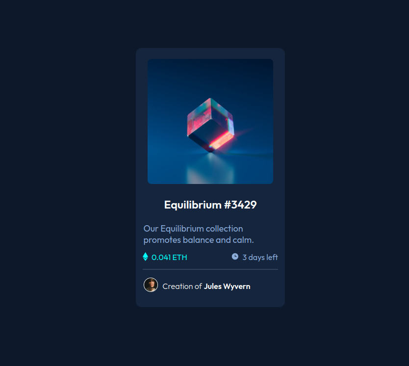

# Frontend Mentor - NFT preview card component solution

This is a solution to the [NFT preview card component challenge on Frontend Mentor](https://www.frontendmentor.io/challenges/nft-preview-card-component-SbdUL_w0U). Frontend Mentor challenges help you improve your coding skills by building realistic projects.

## Table of contents

  - [Screenshot](#screenshot)
  - [Links](#links)
  - [Built with](#built-with)
  - [Author](#author)

### Screenshot

### Links

- Solution URL: [Add solution URL here](https://www.frontendmentor.io/solutions/nft-preview-card-component-ripFV-s2Gu)
- Live Site URL: [Add live site URL here](https://fabulous-meerkat-01606f.netlify.app/)

### Built with

- Semantic HTML5 markup
- CSS custom properties

## Author

- myportfolio - [Katerina Sarantopoulou](https://myportfolio-katesarant.netlify.app/)
- Frontend Mentor - [@kate-sarant](https://www.frontendmentor.io/profile/kate-sarant)
- Github - [kate-sarant](https://github.com/kate-sarant)
